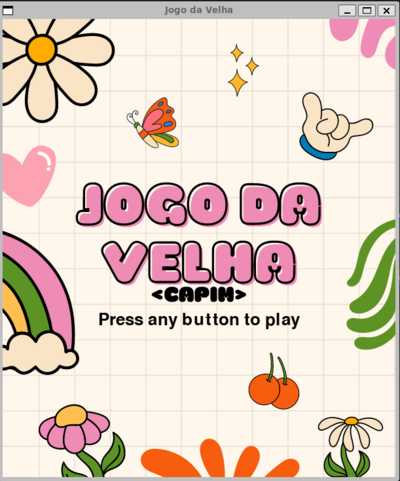

# Jogo da Velha - Capim
Este projeto é uma implementação do clássico jogo da velha utilizando Python e a biblioteca Pygame. O jogo permite que dois jogadores se enfrentem em uma partida local, onde cada jogador alterna entre X e O até que haja um vencedor ou o tabuleiro fique cheio.

<p align="center">

</p>

## Como Executar
Para executar o jogo, siga os passos abaixo:

1. **Clone o repositório:**
   ```bash
   git clone <URL-do-repositorio>
   cd Jogo_da_Velha-Capim 
2. **Crie e ative um ambiente virtual:**
   ```bash
   make venv 
3. **Inicie o jogo:**
   ```bash
   make run 
## Como Jogar
1. Após iniciar o jogo, uma tela inicial será exibida. Pressione qualquer tecla para começar.
2. Cada jogador deve clicar em uma célula vazia do tabuleiro para marcar com seu símbolo (X ou O).
3. O objetivo é formar uma linha de três símbolos iguais, seja na horizontal, vertical ou diagonal.
4. O jogo termina quando um jogador vence ou quando todas as células do tabuleiro estão preenchidas, resultando em um empate.
5. Para reiniciar o jogo, clique no botão "Restart" que aparece na parte inferior da tela, ou, quando acabar o jogo, apenas pressione qualquer tecla.

## Testes
Para executar os testes unitários do projeto, utilize o comando abaixo:
```bash
make test
```
Os testes verificam as funcionalidades principais do jogo, incluindo condições de vitória e preenchimento do tabuleiro.

## Tecnologias Utilizadas
- Python
- Pygame
